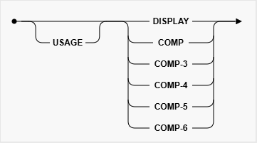

# Get The Picture

Java library for working with COBOL Copybook–based data  
用於處理以 COBOL Copybook 為基礎資料的 Java 類別庫  

> **用 Java 讀懂你 COBOL 的明白**  

## 開發需求
- **Java 17+** 或更新版本

## 輸入格式需求
- COBOL Copybook (`.cpy`) 純文字檔案
- ASCII / CP950 編碼

  

# PICTURE 子句

  

支援的 ***character-string*** (`Symbols`) 語法  

| Alphabetic | Alphanumeric | Numeric | Numeric (With Sign) |
| :--------: | :----------: | :-----: | :-----------------: |
| A..   A(n) | X..   X(n) | 9...   9(n)   9...V9...   9(n)V9(m)   9(n)V9... | S9...   S9(n)   S9...V9...   S9(n)V9(m)   S9(n)V9... |

 

## 類別(`Category`)資料

- [文字 (`Alphabetic`/`Alphanumeric`)](/docs/get-the-picture-4-j/cobol-picture/category/alphabetic-alphanumeric.md)  
- [數字 (`Numeric`)](/docs/get-the-picture-4-j/cobol-picture/category/numeric.md)  
    - [`S9`數字轉換規則](/docs/get-the-picture-4-j/other-topics/pic-s9-overpunch.md)  

 

## 語意(`Semantic`)資料

- [日期 (`Date`)](/docs/get-the-picture-4-j/cobol-picture/semantic/date-time/date.md)  
- [時間 (`Time`)](/docs/get-the-picture-4-j/cobol-picture/semantic/date-time/time.md)  
- [時間戳記 (`Timestamp`)](/docs/get-the-picture-4-j/cobol-picture/semantic/date-time/timestamp.md)  
- [布林值 (`Boolean`)](/docs/get-the-picture-4-j/cobol-picture/semantic/boolean.md)

  

# USAGE 子句

  

`USAGE` 定義欄位在記憶體中的儲存方式，影響資料的物理編碼與運算行為。  
- DISPLAY（預設）：以可讀**字元**存放，每個數字或字母對應一個 byte，便於輸入輸出與檢視。  
- ***COMPUTATIONAL***：用**電腦原生格式**儲存，只用於 `Numeric` 欄位。
    - COMP-3（Packed Decimal）：將兩個數字壓縮在一個 nibble，最後一個 nibble 用於符號，節省空間且方便算術運算。  
    - COMP-4（Binary）/ COMP-5（Native Binary）：以二進位形式存放，運算效率高 (對 COBOL 而言)，但不可直接讀取文字。  
    - COMP-6（Unsigned Packed Decimal）：非標準 COBOL 定義。與 COMP-3 方式一樣，但是沒有 sign nibble。

 

USAGE 項目的適用範圍:  
| Class | Category/Semantic | Usage |
| :---: | :---------------: | ----- |
| Alphabetic | Alphabetic | DISPLAY |
| Alphanumeric | Alphanumeric | DISPLAY |
| Numeric | Numeric | DISPLAY   COMP (Binary)   COMP-3 (Packed Decimal)   COMP-4 (Binary)   COMP-5 (Native Binary)   COMP-6 (Unsigned Packed Decimal) |
| Date-Time | Date   Time   Timestamp | DISPLAY |

 

📖 更多關於 [COMPUTATIONAL 轉換規則](/docs/get-the-picture-4-j/other-topics/cobol-computational.md) ...  

  
